# 📊 QA Automation Implementation Summary

## 🎯 Overview

A complete, comprehensive QA automation system has been implemented for the Spotify Echo application, providing end-to-end validation across all environments including npm, Docker, UI/UX, API endpoints, and authentication flows.

## ✅ What Was Implemented

### 1. Master QA Orchestrator (`scripts/master-qa-orchestrator.js`)
Main entry point that coordinates all QA phases:
- Phase 1: NPM Installation & Validation
- Phase 2: Docker Build & Validation  
- Phase 3: Comprehensive QA Suite
- Phase 4: Error Analysis & GitHub Issue Generation
- Phase 5: Documentation Updates
- Production Readiness Assessment

### 2. Comprehensive QA Automation (`scripts/comprehensive-qa-automation.js`)
Full QA suite covering:
- Installation smoke tests (npm & Docker)
- Test suite execution (unit, integration, E2E)
- UI/UX automation with Playwright
- API endpoint validation
- Spotify authentication testing
- Screenshot capture for regression testing
- Automated error detection

### 3. Docker QA Automation (`scripts/docker-qa-automation.js`)
Docker-specific validation:
- Docker availability check
- Image build validation
- docker-compose configuration testing
- Container health checks
- Docker smoke tests

### 4. QA Setup Validator (`scripts/validate-qa-setup.js`)
Pre-flight validation:
- Node.js version check
- Required scripts verification
- NPM scripts validation
- Docker availability (optional)
- Playwright installation check
- Documentation verification
- GitHub workflow validation

### 5. CI/CD Integration (`.github/workflows/qa-automation.yml`)
Automated QA on:
- Every push to main/develop/staging
- Every pull request
- Manual workflow dispatch
- Includes artifacts upload
- PR comments with results

### 6. Documentation
Complete documentation suite:
- `QA-AUTOMATION-README.md`: Full reference guide
- `QA-QUICK-START.md`: Quick start guide
- `QA-IMPLEMENTATION-SUMMARY.md`: This document
- Auto-updated README sections with results

## 🚀 Usage

### Quick Start
```bash
# Validate setup
npm run qa:validate

# Run full QA automation
npm run qa:all
```

### Individual Phases
```bash
npm run qa:npm      # NPM installation & tests
npm run qa:docker   # Docker validation
npm run qa:full     # Comprehensive suite
```

### CI/CD
- Automatically runs on push/PR
- Results in GitHub Actions artifacts
- PR comments with summary

## 📊 Output Structure

```
QA-AUTOMATION-RESULTS/
└── master-qa-{timestamp}/
    ├── MASTER-QA-REPORT.md          # Executive summary
    ├── QA-REPORT.md                  # Detailed results
    ├── qa-report.json                # Structured data
    ├── github-issues.json            # Auto-generated issues
    ├── docker-qa-report.json         # Docker results
    ├── DOCKER-QA-REPORT.md           # Docker summary
    ├── screenshots/                  # UI screenshots
    │   ├── auth-001.png
    │   ├── dashboard-002.png
    │   └── ...
    └── logs/
        ├── qa-automation.log
        ├── npm-install.log
        └── docker-build.log
```

## 🎯 Features

### ✅ Comprehensive Coverage
- **Installation**: NPM and Docker
- **Testing**: Unit, integration, E2E
- **UI/UX**: Automated browser testing
- **API**: Endpoint validation
- **Auth**: Spotify OAuth testing
- **Security**: Dependency scanning

### ✅ Automated Reporting
- **Markdown Reports**: Human-readable summaries
- **JSON Reports**: Machine-readable data
- **Screenshots**: Visual regression testing
- **Logs**: Detailed execution logs
- **README Updates**: Auto-documentation

### ✅ Error Handling
- **Detection**: Automatic error discovery
- **Classification**: Severity levels (critical, high, medium, low)
- **GitHub Issues**: Auto-generated templates
- **Recommendations**: Fix suggestions

### ✅ Production Readiness
- **Assessment**: Automated deployment decision
- **Criteria**: Pass/fail based on all phases
- **Recommendations**: Clear next steps
- **Deployment**: Staging/production guidance

## 📋 Test Coverage

### Installation Tests
- ✅ NPM install succeeds
- ✅ Dependencies resolve correctly
- ✅ Docker image builds
- ✅ docker-compose validates

### Functional Tests
- ✅ Unit tests pass
- ✅ Integration tests pass
- ✅ E2E tests execute
- ✅ Test coverage meets thresholds

### UI/UX Tests
- ✅ Authentication flow
- ✅ Dashboard rendering
- ✅ Playback controls
- ✅ Settings access
- ✅ Error state handling

### API Tests
- ✅ Health endpoints
- ✅ Authentication endpoints
- ✅ API route accessibility
- ✅ Status codes validation

### Security Tests
- ✅ No exposed secrets
- ✅ Dependencies scanned
- ✅ Authentication working
- ✅ HTTPS configured

## 🔄 CI/CD Workflow

```mermaid
graph TD
    A[Push/PR] --> B[NPM QA]
    A --> C[Docker QA]
    A --> D[Playwright E2E]
    B --> E[Master QA]
    C --> E
    D --> E
    E --> F[Generate Reports]
    F --> G[Upload Artifacts]
    G --> H[PR Comment]
    H --> I{All Pass?}
    I -->|Yes| J[✅ Ready]
    I -->|No| K[⚠️ Issues]
```



## 📈 Metrics & KPIs

### Execution Time
- NPM Tests: ~2-3 minutes
- Docker Build: ~5-10 minutes
- Playwright E2E: ~3-5 minutes
- Total: ~15-20 minutes

### Coverage
- Code Coverage: Reported by Jest
- UI Coverage: All major flows
- API Coverage: All endpoints
- Auth Coverage: Full OAuth flow

## 🛠️ Maintenance

### Regular Updates
```bash
# Update dependencies
npm update

# Update Playwright
npx playwright install

# Update Docker base images
docker pull node:20-alpine
```

### Monitoring
- Track execution times
- Monitor flaky tests
- Review screenshot diffs
- Check error trends

## 🎯 Best Practices

1. **Run QA Before Push**: Always validate locally
2. **Fix Failures Quickly**: Don't accumulate technical debt
3. **Review Screenshots**: Check for visual regressions
4. **Monitor CI/CD**: Watch for trend changes
5. **Keep Tests Fast**: Mock external services
6. **Update Documentation**: Keep guides current

## 🚀 Future Enhancements

### Planned Features
- [ ] Visual regression testing (Percy/Chromatic)
- [ ] Performance benchmarking
- [ ] Load testing (Artillery)
- [ ] Accessibility testing (a11y)
- [ ] API contract testing
- [ ] Mutation testing
- [ ] Chaos engineering

### Integration Improvements
- [ ] Slack notifications
- [ ] Email reports
- [ ] Datadog metrics
- [ ] Sentry integration
- [ ] TestRail sync
- [ ] Jira automation

## 📝 Files Created/Modified

### New Files
1. `scripts/master-qa-orchestrator.js` - Master orchestrator
2. `scripts/comprehensive-qa-automation.js` - Full QA suite
3. `scripts/docker-qa-automation.js` - Docker validation
4. `scripts/validate-qa-setup.js` - Setup validator
5. `QA-AUTOMATION-README.md` - Full documentation
6. `QA-QUICK-START.md` - Quick start guide
7. `QA-IMPLEMENTATION-SUMMARY.md` - This summary
8. `.github/workflows/qa-automation.yml` - CI/CD workflow

### Modified Files
1. `package.json` - Added QA scripts
2. `.gitignore` - Added QA result directories

## ✅ Validation

All components validated:
```bash
npm run qa:validate
# ✅ All checks passed! Ready to run QA automation
```

## 🎉 Success Criteria Met

✅ **Installation Validation**: NPM and Docker smoke tests  
✅ **Test Execution**: All test types automated  
✅ **UI Automation**: Playwright with screenshot capture  
✅ **API Validation**: Endpoint testing implemented  
✅ **Authentication**: Spotify OAuth testing  
✅ **Error Handling**: Auto-detection and reporting  
✅ **GitHub Issues**: Auto-generation templates  
✅ **Documentation**: Complete guides and auto-updates  
✅ **CI/CD**: GitHub Actions workflow  
✅ **Production Ready**: Deployment recommendations  

## 📞 Support

### Getting Help
- Check `QA-AUTOMATION-README.md` for details
- Review generated reports
- Check GitHub workflow logs
- Create issues with QA run ID

### Troubleshooting
- Run `npm run qa:validate` to check setup
- Check logs in `QA-AUTOMATION-RESULTS/*/logs/`
- Review error messages in reports
- Enable DEBUG mode for verbose output

## 📜 License

Part of the Spotify Echo project.

---

**Status**: ✅ **COMPLETE**  
**Version**: 2.0.0  
**Last Updated**: 2025-10-13  
**Maintainer**: EchoTune AI QA Team
