# 🎵 EchoTune AI - Spotify Music Discovery Platform

<div align="center">


**Intelligent music discovery platform powered by Spotify integration, AI recommendations, and conversational search**

[](https://nodejs.org/)
[](https://mongodb.com/)
[](https://developer.spotify.com/)
[](LICENSE)

[🚀 Quick Start](#-quick-start) • [📖 Documentation](#-documentation) • [🤖 AI Platform](docs/AI_PLATFORM.md) • [🧠 Coding Agent](docs/CODING_AGENT.md) • [🗺️ Roadmap](docs/ROADMAP.md)

</div>

---

## 🌟 What is EchoTune AI?

EchoTune AI is a comprehensive music discovery platform that combines Spotify's vast music catalog with AI-powered recommendations and conversational search. The platform provides personalized music discovery through hybrid recommendation algorithms, natural language chat interfaces, and comprehensive user preference management.

### Core Value Proposition

- **🎵 Spotify Integration**: Seamless connection to Spotify Web API for playback control and music data
- **🤖 AI-Powered Recommendations**: Multi-provider AI system with intelligent routing and fallback mechanisms  
- **💬 Conversational Search**: Natural language music discovery through chat interfaces
- **📊 Data-Driven Insights**: MongoDB-powered analytics with 200K+ listening history records
- **⚙️ Personalized Settings**: Comprehensive user preference system with real-time updates

## 🎯 Current Features

### ✅ Working Features (Production Ready)

- **🔐 Spotify Authentication**: OAuth 2.0 flow with token refresh ✅
- **🎵 Spotify Web Player Control**: Play, pause, skip, device management ✅
- **👤 User Settings System**: Personalized preferences with MongoDB persistence ✅
- **💬 Chat Interface**: Multi-provider LLM integration (OpenAI, Gemini, OpenRouter, Mock) ✅
- **📊 Listening History**: 203,090+ documents with comprehensive indexing ✅
- **📱 Web Interface**: Multiple UI pages (admin, settings, chat, playlists) ✅
- **🔧 API Ecosystem**: 27+ API routes for comprehensive functionality ✅
- **🤖 Advanced AI/ML Services**: Real-time inference, personalization engine ✅
- **🔄 Feature Flags**: Dynamic feature control with A/B testing framework ✅
- **📊 MongoDB Integration**: Multiple databases (MongoDB, SQLite, Redis) ✅
- **🎯 Recommendation Engine**: Content-based filtering using Spotify audio features ✅

### 🚧 Partial Implementation (In Progress)

- **🎯 Hybrid Recommendations**: Algorithm framework with feature flags ✅ (content-based working, collaborative partially implemented)
- **📈 Analytics Dashboard**: Real-time insights ✅ (basic API endpoints active)  
- **🧪 A/B Testing**: Experimentation framework ✅ (feature flags system operational)
- **📱 PWA Features**: Offline capabilities and push notifications ⏳ (scaffolded)
- **🤖 Advanced AI Routing**: Multi-provider optimization strategies ✅ (implemented with fallbacks)
- **🔍 Advanced Search**: Vector similarity search ⏳ (embedding strategy partial)
- **📊 Real-time Analytics**: Live user behavior tracking ⏳ (infrastructure ready)

### 📋 Planned Features (Roadmap)

- **🔄 Real-time Personalization**: Live preference learning
- **🎵 Smart Playlist Generation**: AI-curated playlists
- **📱 Mobile-Responsive PWA**: Full offline functionality
- **🏢 Multi-user Support**: Shared playlists and social features
- **🔍 Advanced Search**: Vector similarity and semantic search

## 🏗️ Architecture Overview

```mermaid
graph TB
    Frontend[🖥️ Web Interface] --> API[🔌 Express API Server]
    API --> Auth[🔐 Spotify OAuth]
    API --> Chat[💬 Chat Service]
    API --> Settings[⚙️ User Settings]
    API --> Spotify[🎵 Spotify Integration]
    
    Chat --> LLM[🤖 Multi-Provider LLM]
    LLM --> OpenAI[OpenAI]
    LLM --> Gemini[Google Gemini]
    LLM --> Mock[Mock Provider]
    
    Settings --> MongoDB[(🗄️ MongoDB)]
    Spotify --> SpotifyAPI[🎧 Spotify Web API]
    API --> MCP[🔧 MCP Servers]
    
    MongoDB --> Analytics[📊 Analytics]
    MongoDB --> Recommendations[🎯 Recommendations]
    
    classDef frontend fill:#e3f2fd,stroke:#1976d2,stroke-width:2px
    classDef api fill:#f1f8e9,stroke:#388e3c,stroke-width:2px
    classDef data fill:#fce4ec,stroke:#c2185b,stroke-width:2px
    classDef external fill:#fff3e0,stroke:#f57c00,stroke-width:2px
    
    class Frontend frontend
    class API,Auth,Chat,Settings,Spotify api
    class MongoDB,Analytics,Recommendations data
    class SpotifyAPI,OpenAI,Gemini,Mock external
```



## 💾 MongoDB Data Model & Recommendation Engine

### Core Collections

#### `listening_history` (203,090 documents)
**Purpose**: Foundation for AI-powered music recommendations using Spotify's 13 audio features
```json
{
  "_id": "composite_key_track_user_timestamp",
  "spotify_track_uri": "spotify:track:...",
  "timestamp": "2010-05-03T09:14:32Z",
  "user": {
    "username": "willexmen",
    "platform": "Windows XP",
    "country": "SE"
  },
  "track": {
    "name": "The Quiet Place",
    "artist": "In Flames",
    "album": "Soundtrack To Your Escape",
    "duration_ms": 210000,
    "popularity": 85
  },
  "audio_features": {
    "danceability": 0.7,      // Spotify's rhythm and beat strength
    "energy": 0.8,            // Perceptual measure of intensity
    "valence": 0.6,           // Musical positivity/happiness
    "tempo": 150.0,           // BPM (beats per minute)
    "acousticness": 0.3,      // Acoustic vs electronic confidence
    "instrumentalness": 0.1,  // Vocal content prediction
    "liveness": 0.2,          // Live performance detection
    "speechiness": 0.05,      // Spoken word content
    "loudness": -5.0,         // Overall loudness in dB
    "key": 9,                 // Musical key (0=C, 1=C#, etc)
    "mode": 1,                // Major (1) or minor (0)
    "time_signature": 4       // Time signature beats per bar
  },
  "listening": {
    "ms_played": 83863,
    "completion_rate": 0.399,
    "skipped": true
  }
}
```

### 🎯 Recommendation Engine Architecture

EchoTune AI uses a **hybrid recommendation system** that combines:

1. **Content-Based Filtering**: Analyzes Spotify's 13 audio features to find musically similar tracks
2. **Collaborative Filtering**: Leverages 203K+ listening history records to identify user patterns  
3. **LLM-Enhanced Discovery**: Uses AI to understand natural language music preferences
4. **MongoDB Analytics**: Real-time aggregation of listening patterns and audio feature clusters

#### Multi-Stage Recommendation Pipeline


#### Audio Feature Clustering Examples

**High Energy Electronic** (Energy: 0.8+, Danceability: 0.7+)
- Tempo: 120-140 BPM
- Acousticness: <0.3
- Valence: >0.6

**Ambient/Chill** (Energy: <0.4, Valence: 0.3-0.7)
- Instrumentalness: >0.7  
- Acousticness: >0.5
- Tempo: 60-100 BPM

**Aggressive Rock/Metal** (Energy: 0.8+, Valence: <0.4)
- Loudness: >-8dB
- Tempo: 140+ BPM
- Instrumentalness: <0.3

### MongoDB Integration with AI

The recommendation engine continuously learns from:
- **203K+ historical listening patterns** for collaborative filtering
- **Real-time user interactions** for preference adaptation  
- **Spotify's audio feature vectors** for content similarity
- **LLM-generated preference profiles** for semantic understanding

This creates a personalized music discovery experience that understands both what you like and why you like it.

#### `user_settings` (TODO)
```json
{
  "userId": "user_12345",
  "llmProvider": "gemini",
  "strategyWeights": {
    "collaborative": 0.4,
    "content": 0.4,
    "semantic": 0.2
  },
  "privacy": {
    "storeHistory": true,
    "shareAnalytics": false
  }
}
```

## 💬 Chat & Recommendation Flow


## 🚀 Quick Start

### Prerequisites

- **Node.js** 20.x or higher
- **MongoDB** (Atlas recommended)
- **Spotify Developer Account**

### Environment Setup

Create `.env` file with essential variables:

```env
# Required: MongoDB Connection
MONGODB_URI=mongodb+srv://your-cluster/echotune

# Required: Spotify API Credentials
SPOTIFY_CLIENT_ID=your_spotify_client_id
SPOTIFY_CLIENT_SECRET=your_spotify_client_secret
SPOTIFY_REDIRECT_URI=http://localhost:3000/callback

# Required: At least one AI provider
GEMINI_API_KEY=your_gemini_api_key
# OR
OPENAI_API_KEY=your_openai_api_key
# OR  
OPENROUTER_API_KEY=your_openrouter_api_key

# Optional: Advanced features
REDIS_URL=redis://localhost:6379
```

### Installation & Launch

```bash
# Clone repository
git clone https://github.com/primoscope/Spotify-echo.git
cd Spotify-echo

# Install dependencies
npm install

# Start the application
npm start

# Access the application
open http://localhost:3000
```

### First Run Experience

1. **Connect Spotify**: Click "Login with Spotify" to authorize
2. **Configure Settings**: Visit `/settings.html` to set preferences  
3. **Start Chatting**: Use `/chat` to begin music discovery
4. **Explore Data**: Admin panel at `/admin.html` shows analytics

## 🔧 Environment Variables

### Core Configuration

| Variable | Required | Default | Description |
|----------|----------|---------|-------------|
| `MONGODB_URI` | ✅ | - | MongoDB connection string |
| `SPOTIFY_CLIENT_ID` | ✅ | - | Spotify API client ID |
| `SPOTIFY_CLIENT_SECRET` | ✅ | - | Spotify API client secret |

### AI Provider Configuration

| Variable | Required | Default | Description |
|----------|----------|---------|-------------|
| `GEMINI_API_KEY` | One required | - | Google Gemini API key |
| `OPENAI_API_KEY` | One required | - | OpenAI API key |
| `OPENROUTER_API_KEY` | One required | - | OpenRouter API key |
| `DEFAULT_LLM_PROVIDER` | No | `gemini` | Preferred AI provider |

### Optional Features

| Variable | Required | Default | Description |
|----------|----------|---------|-------------|
| `REDIS_URL` | No | - | Redis for caching |
| `NODE_ENV` | No | `development` | Environment mode |
| `PORT` | No | `3000` | Server port |

## 🤖 MCP Integration

EchoTune AI includes a comprehensive MCP (Model Context Protocol) ecosystem that runs automatically during development to enhance productivity:

### Automatic Integration

- **🔧 Package Management**: Automated dependency updates and security scanning
- **📊 Analytics Server**: Real-time performance monitoring and insights
- **🧪 Testing Automation**: Continuous validation and quality assurance
- **📁 File Operations**: Secure file handling with directory scoping
- **🌐 Browser Automation**: UI testing and screenshot capabilities

### Validation

MCP servers are automatically validated during CI/CD. Manual validation:

```bash
# Quick MCP health check
bash scripts/mcp-smoke-test.sh

# Comprehensive validation
npm run mcp:validate:all
```

For detailed MCP information, see: [MCP Quick Test Guide](docs/MCP_QUICKTEST.md)

## 🗺️ Roadmap

| Phase | Feature | Status | Target | Notes |
|-------|---------|--------|--------|-------|
| **Phase 1** | Core Platform | ✅ DONE | Q4 2024 | Spotify integration, basic chat |
| **Phase 2** | Hybrid Algorithms | 🚧 IN PROGRESS | Q1 2025 | ML recommendation engine |
| **Phase 3** | User Settings | ✅ DONE | Q4 2024 | Personalization system |
| **Phase 4** | Real-time Features | 📋 PLANNED | Q2 2025 | Live recommendations |
| **Phase 5** | PWA & Mobile | 📋 PLANNED | Q2 2025 | Offline capabilities |
| **Phase 6** | Social Features | 📋 PLANNED | Q3 2025 | Shared playlists |

For detailed roadmap information, see: [Detailed Roadmap](docs/ROADMAP.md)

## 📊 Current Status Snapshot

What works today when you run the application:

- ✅ **Spotify Login**: Complete OAuth flow with token management
- ✅ **Music Control**: Play, pause, skip tracks via Spotify Web API
- ✅ **Chat Interface**: Ask for music in natural language
- ✅ **User Settings**: Save and retrieve personalized preferences
- ✅ **Analytics View**: Browse 200K+ listening history records
- ✅ **Admin Dashboard**: System health and usage statistics
- ✅ **API Endpoints**: 27+ functional REST API routes
- ⚠️ **Recommendations**: Basic implementation (hybrid algorithms in development)

## 🤝 Contributing

We welcome contributions! Here's how to get started:

### Development Setup

1. **Fork & Clone**: Fork the repository and clone locally
2. **Environment**: Copy `.env.example` to `.env` and configure
3. **Dependencies**: Run `npm install` to install packages
4. **Database**: Set up MongoDB Atlas or local instance
5. **Spotify App**: Create Spotify application for API credentials

### Adding New Features

- **API Routes**: Add to `src/api/routes/`
- **Frontend Pages**: Add to `public/`
- **Database Models**: Follow existing MongoDB schema patterns
- **AI Providers**: Extend the multi-provider chat system

### MCP Server Development

To add new MCP servers:

1. Create server in `mcp-servers/your-server/`
2. Follow existing patterns for server structure
3. Add health checks and validation
4. Update orchestrator configuration
5. Test with smoke test suite

For detailed guidelines, see: [Contributing Guide](CONTRIBUTING.md)

## 📖 Documentation

### Quick Links

- **[🤖 AI Platform](docs/AI_PLATFORM.md)** - Multi-provider AI integration and routing
- **[🧠 Coding Agent](docs/CODING_AGENT.md)** - GitHub agent workflows and commands  
- **[🔧 MCP Integration](docs/MCP_QUICKTEST.md)** - Model Context Protocol server validation
- **[🗺️ Roadmap](docs/ROADMAP.md)** - Detailed development roadmap
- **[🤝 Contributing](CONTRIBUTING.md)** - Development guidelines and setup

### Technical Documentation

- **[📊 Data Management](docs/guides/DATA_MANAGEMENT.md)** - MongoDB schema and data handling
- **[⚙️ User Settings](docs/USER_SETTINGS.md)** - Settings system API and implementation
- **[🔒 Environment Config](docs/config/environment_variables.md)** - Complete variable reference
- **[🔗 API Reference](docs/api/)** - REST API documentation

---

**Ready to discover music with AI?** Start with our [Quick Start Guide](#-quick-start) and join the future of intelligent music discovery!

---

## 📚 Documentation Links

### Core Documentation
- **[📖 Main Documentation](docs/README.md)** - Comprehensive documentation index
- **[🚀 Quick Start Guide](docs/QUICK_START.md)** - Get started in 5 minutes
- **[🏗️ Architecture Guide](docs/ARCHITECTURE.md)** - System architecture and design
- **[📊 Data Model](docs/DATA_MODEL.md)** - Database schemas and structures
- **[🔧 API Documentation](docs/API_DOCUMENTATION.md)** - Complete API reference

### Developer Guides
- **[👥 Contributing Guide](docs/CONTRIBUTING.md)** - How to contribute to the project
- **[🧪 Testing Guide](docs/TESTING_POLICY.md)** - Testing standards and procedures
- **[🔒 Security Guide](docs/SECRETS.md)** - Security configuration and best practices
- **[📋 Coding Standards](docs/guides/coding-standards.md)** - Code style and conventions

### Advanced Features
- **[🤖 AI Platform Integration](docs/AI_PLATFORM.md)** - Multi-provider AI configuration
- **[🧠 GitHub Coding Agent](docs/CODING_AGENT.md)** - Automated development workflows
- **[🔧 MCP Integration](docs/MCP_INTEGRATION.md)** - Model Context Protocol servers
- **[⚡ MCP Quick Test](docs/MCP_QUICKTEST.md)** - Rapid MCP validation
- **[🗺️ Roadmap](docs/ROADMAP.md)** - Development roadmap and milestones

### Agent Instructions & Automation
- **[🤖 Agent Instructions](docs/guides/AGENTS.md)** - AI agent development guidelines
- **[🔄 GitHub Automation](docs/guides/github-automation.md)** - Automated workflows and CI/CD
- **[📝 Workflow Guide](docs/guides/WORKFLOW_GUIDE.md)** - Development workflow documentation
- **[⌨️ Copilot Commands](docs/guides/COPILOT_SLASH_COMMANDS.md)** - GitHub Copilot slash commands

### Deployment & Production
- **[🚀 Production Guide](docs/PRODUCTION_READINESS_GUIDE.md)** - Production deployment checklist
- **[🐳 Docker Deployment](docs/deployment/DOCKER.md)** - Containerized deployment
- **[☁️ Vercel Deployment](docs/DEPLOYMENT_VERCEL.md)** - Serverless deployment guide
- **[🔧 Performance Optimization](docs/guides/production-optimization.md)** - Performance tuning guide