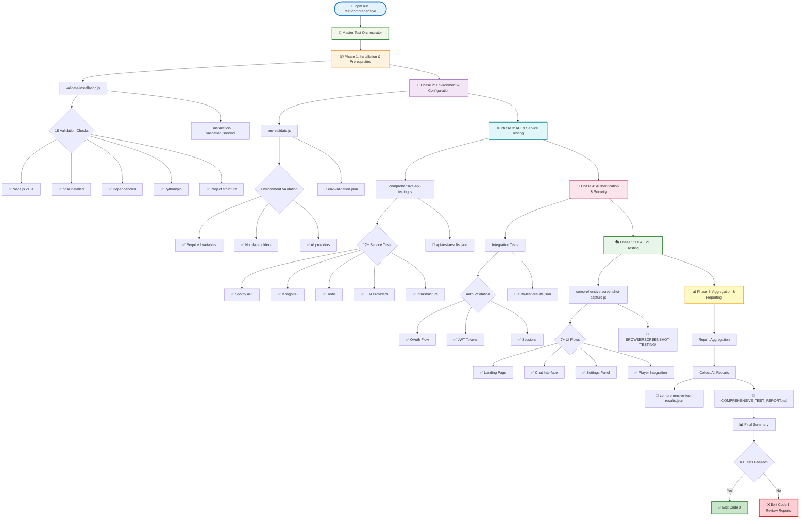
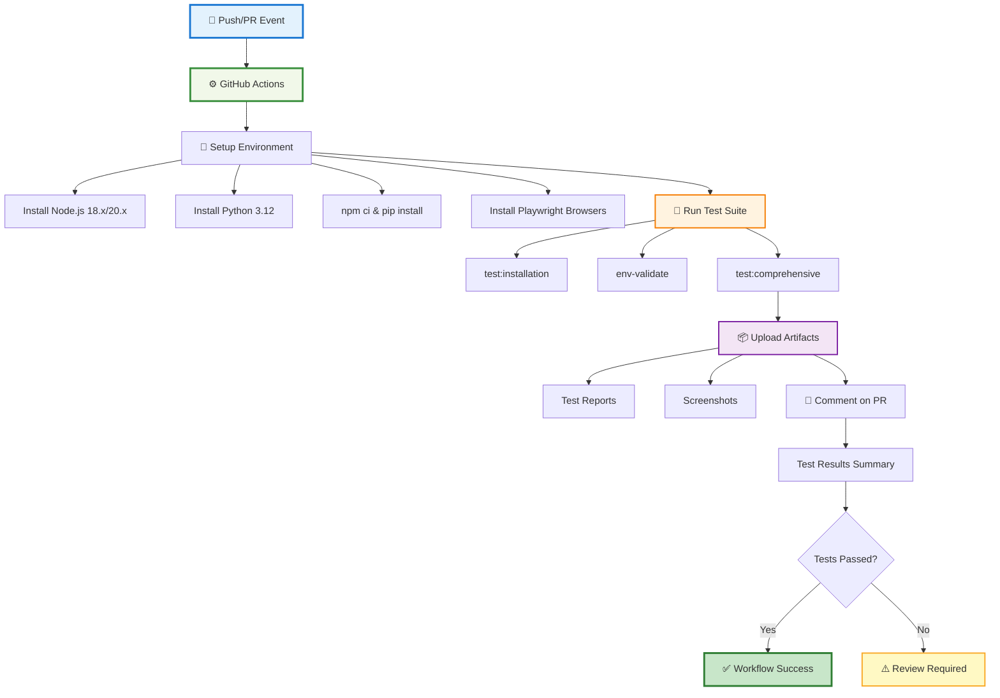

# 📊 Comprehensive Test Suite - Visual Flow

## Test Execution Flow



## Report Generation Flow

```mermaid
graph LR
    Tests[🧪 Test Suites] --> Reports[📁 reports/]
    
    Reports --> JSON1[installation-validation.json]
    Reports --> JSON2[env-validation.json]
    Reports --> JSON3[api-test-results.json]
    Reports --> JSON4[auth-test-results.json]
    Reports --> JSON5[comprehensive-test-results.json]
    
    Reports --> MD1[installation-validation.md]
    Reports --> MD2[COMPREHENSIVE_TEST_REPORT.md]
    
    Tests --> Screenshots[📸 BROWSERSCREENSHOT-TESTING/]
    Screenshots --> RunDirs[run-{timestamp}/]
    RunDirs --> FlowDirs[auth/, chat/, settings/, ...]
    
    JSON5 --> Schema[📋 Schema v2 Compliant]
    MD2 --> Root[📄 Root Directory Copy]
    
    style Tests fill:#e3f2fd,stroke:#1976d2,stroke-width:2px
    style Reports fill:#f1f8e9,stroke:#388e3c,stroke-width:2px
    style Screenshots fill:#fce4ec,stroke:#c2185b,stroke-width:2px
    style Schema fill:#fff3e0,stroke:#f57c00,stroke-width:2px
    style Root fill:#e8f5e9,stroke:#2e7d32,stroke-width:2px
```

## CI/CD Integration Flow



## Test Coverage Matrix

| Component | Tests | Status | Reports |
|-----------|-------|--------|---------|
| **Installation** | Node.js, npm, deps, Python, structure | ✅ 18 checks | JSON + MD |
| **Environment** | Variables, placeholders, providers | ✅ Multi-check | JSON |
| **APIs** | Spotify, MongoDB, Redis, LLMs, Infra | ✅ 12+ services | JSON |
| **Authentication** | OAuth, JWT, sessions | ✅ Integration tests | JSON |
| **UI** | Pages, flows, responsive, errors | ✅ 7+ flows | Screenshots |
| **Reporting** | Aggregation, schema v2, summaries | ✅ Full coverage | JSON + MD |

## Quick Command Reference

```bash
# Run all tests
npm run test:comprehensive
├── Phase 1: Installation ────→ validate-installation.js
├── Phase 2: Environment ────→ env-validate.js
├── Phase 3: APIs ───────────→ comprehensive-api-testing.js
├── Phase 4: Auth ───────────→ integration tests
├── Phase 5: UI ─────────────→ comprehensive-screenshot-capture.js
└── Phase 6: Reports ────────→ COMPREHENSIVE_TEST_REPORT.md

# Run individual components
npm run test:installation              # Phase 1 only
node scripts/env-validate.js           # Phase 2 only
node scripts/comprehensive-api-testing.js  # Phase 3 only
```

## File Structure Tree

```
EchoTune-AI/
│
├── 🧪 Test Scripts
│   ├── scripts/
│   │   ├── validate-installation.js      (NEW - 15K)
│   │   ├── run-comprehensive-tests.js    (NEW - 16K)
│   │   ├── env-validate.js               (Existing)
│   │   ├── comprehensive-api-testing.js  (Existing)
│   │   └── comprehensive-screenshot-capture.js (Existing)
│
├── 📚 Documentation
│   ├── docs/
│   │   ├── COMPREHENSIVE_TEST_GUIDE.md   (NEW - 9.6K)
│   │   └── TEST_STRATEGY.md              (Existing)
│   ├── TESTING_README.md                 (NEW - 3.8K)
│   └── TEST_IMPLEMENTATION_SUMMARY.md    (NEW - 9.0K)
│
├── ⚙️ CI/CD
│   └── .github/workflows/
│       └── comprehensive-tests.yml       (NEW - 5.4K)
│
├── 📊 Generated Reports
│   ├── reports/
│   │   ├── installation-validation.json
│   │   ├── installation-validation.md
│   │   ├── env-validation.json
│   │   ├── api-test-results.json
│   │   └── comprehensive-test-results.json
│   └── COMPREHENSIVE_TEST_REPORT.md      (Root copy)
│
└── 📸 Screenshots
    └── BROWSERSCREENSHOT-TESTING/
        └── {run-id}/
            ├── auth/
            ├── chat/
            ├── settings/
            └── ...
```

## Success Criteria

```
✅ Installation Valid
   └── Node.js v16+ ✅
   └── npm installed ✅
   └── Dependencies ✅
   └── Python/pip ✅
   └── Structure ✅

✅ Environment Valid
   └── No placeholders ✅
   └── Required vars ✅
   └── Providers configured ✅

✅ APIs Working
   └── Spotify ✅
   └── MongoDB ✅
   └── Redis ✅
   └── LLM Providers ✅

✅ Auth Working
   └── OAuth flow ✅
   └── JWT tokens ✅
   └── Sessions ✅

✅ UI Captured
   └── All pages ✅
   └── All flows ✅
   └── Responsive ✅

✅ Reports Generated
   └── JSON reports ✅
   └── MD summaries ✅
   └── Screenshots ✅
```

---

**Visual Flow Version**: 1.0.0  
**Last Updated**: 2025-10-12  
**Status**: ✅ Complete and Operational
