# 🤖 AI Platform & Provider Integration

**Comprehensive guide to EchoTune AI's multi-provider AI integration, routing strategies, and advanced configurations**

## 🌟 Overview

EchoTune AI provides enterprise-grade AI integration with intelligent routing, cost optimization, and fallback mechanisms across multiple AI providers. Our platform supports advanced routing strategies and real-time provider health monitoring.

## 🤖 Supported AI Providers

### 🤖 Vertex AI (Google Cloud)
- **Models**: text-bison@latest, textembedding-gecko@latest
- **Features**: Enterprise-grade reliability, cost optimization, auto-scaling endpoints
- **Use Cases**: Production workloads, high-volume requests, embedding generation
- **Pricing**: $0.000125/1K tokens (input/output)

### 🧠 Gemini 2.5 Pro (Google AI)
- **Models**: gemini-2.5-pro (2M context window)
- **Features**: Multimodal capabilities, massive context, advanced reasoning
- **Use Cases**: Complex analysis, long conversations, multimodal content
- **Pricing**: $0.00125/1K input, $0.005/1K output

### 🎭 Claude 3.5 Sonnet (Anthropic)
- **Models**: claude-3-5-sonnet-20241022, claude-3-opus-20240229
- **Features**: Superior reasoning, analysis, function calling
- **Use Cases**: Complex reasoning, detailed analysis, structured output
- **Pricing**: $0.003/1K input, $0.015/1K output

### 🚀 Claude Opus 4.1 (Vertex AI + Anthropic) **[NEW]**
- **Models**: claude-opus-4-1@20250805 via publishers/anthropic/models/claude-opus-4-1
- **Features**: Industry-leading coding capabilities, extended thinking mode, agent workflows, long-horizon tasks
- **Advanced Capabilities**:
  - 🧠 **Extended Thinking**: Budget-controlled deep reasoning with transparent thought processes
  - 💻 **Advanced Coding**: End-to-end development task execution with production-ready code
  - 🤖 **Agent Workflows**: Complex multi-step task automation and orchestration
  - ⏳ **Long-horizon Tasks**: Sustained performance on objectives requiring thousands of steps
  - 🔍 **Agentic Search**: Comprehensive insight synthesis across multiple data sources
  - 💾 **Memory Management**: Context retention across multiple interactions
- **Context**: 200K input tokens, 32K output tokens
- **Extended Thinking Budget**: Configurable up to 32K thinking tokens
- **Use Cases**: Complex development tasks, agent automation, agentic search, coding assistance, architectural analysis
- **Pricing**: $0.015/1K input, $0.075/1K output (premium)
- **Provider**: Accessed through Vertex AI Anthropic publisher system
- **GitHub Integration**: Comprehensive slash command support with natural language triggers

### 🔮 OpenAI (Fallback)
- **Models**: gpt-4-turbo, gpt-3.5-turbo
- **Features**: Reliable fallback, streaming support, function calling
- **Use Cases**: Fallback provider, testing, compatibility
- **Pricing**: Variable based on model

## 🧭 Routing Strategies

The AI Agent Router intelligently selects providers based on:

1. **Cost Optimization**: Selects the most cost-effective provider for the task
2. **Latency Optimization**: Prioritizes fastest response times
3. **Quality Optimization**: Chooses providers with highest quality for complex tasks
4. **Balanced**: Optimizes for a balance of cost, latency, and quality

### Provider Selection Logic

```javascript
// Example: Smart routing based on requirements
const router = new AgentRouter();

// Low-cost strategy for simple tasks
const costOptimized = await router.route(request, {
  strategy: 'low-cost',
  maxCost: 0.001,
  taskType: 'simple-recommendation'
});

// High-quality for complex analysis
const qualityOptimized = await router.route(request, {
  strategy: 'high-quality',
  maxCost: 0.01,
  taskType: 'complex-analysis'
});

// Balanced for general use
const balanced = await router.route(request, {
  strategy: 'balanced',
  maxLatency: 5000,
  maxCost: 0.005
});
```

## 🏗️ AI Provider Architecture

```mermaid
graph LR
    %% Request Flow
    Request[User Request] --> AgentRouter[🧭 Agent Router]
    
    %% Routing Decision
    AgentRouter --> Strategy{Routing Strategy}
    Strategy -->|Low Cost| CostOpt[Cost Optimizer]
    Strategy -->|Low Latency| LatencyOpt[Latency Optimizer]
    Strategy -->|High Quality| QualityOpt[Quality Optimizer]
    Strategy -->|Balanced| BalancedOpt[Balanced Optimizer]
    
    %% Provider Selection
    CostOpt --> ProviderSelect[Provider Selection]
    LatencyOpt --> ProviderSelect
    QualityOpt --> ProviderSelect
    BalancedOpt --> ProviderSelect
    
    %% AI Providers
    ProviderSelect --> Vertex[🤖 Vertex AI<br/>Enterprise Grade<br/>$0.000125/1K tokens]
    ProviderSelect --> Gemini[🧠 Gemini 2.5 Pro<br/>2M Context Window<br/>$0.00125/1K tokens]
    ProviderSelect --> Claude[🎭 Claude 3.5 Sonnet<br/>200K Context<br/>$0.003/1K tokens]
    ProviderSelect --> OpenAI[🔮 OpenAI GPT<br/>Fallback Provider<br/>$0.001/1K tokens]
    
    %% Error Handling
    Vertex --> CircuitBreaker[🛡️ Circuit Breaker]
    Gemini --> CircuitBreaker
    Claude --> CircuitBreaker
    OpenAI --> CircuitBreaker
    
    %% Fallback Chain
    CircuitBreaker -->|Failure| Fallback[Fallback Chain]
    Fallback --> Vertex
    Fallback --> OpenAI
    Fallback --> Mock[🎪 Mock Provider]
    
    %% Response Processing
    Vertex --> ResponseProcessor[📝 Response Processor]
    Gemini --> ResponseProcessor
    Claude --> ResponseProcessor
    OpenAI --> ResponseProcessor
    Mock --> ResponseProcessor
    
    %% Metrics & Monitoring
    ResponseProcessor --> Metrics[📊 Metrics Collection]
    Metrics --> Cost[💰 Cost Tracking]
    Metrics --> Performance[⚡ Performance Metrics]
    Metrics --> Health[🏥 Health Monitoring]
    
    %% Final Response
    ResponseProcessor --> Response[🎵 Music Recommendations]
    
    classDef router fill:#e3f2fd,stroke:#0277bd,stroke-width:2px
    classDef provider fill:#f1f8e9,stroke:#388e3c,stroke-width:2px
    classDef error fill:#ffebee,stroke:#c62828,stroke-width:2px
    classDef monitoring fill:#fce4ec,stroke:#ad1457,stroke-width:2px
    
    class AgentRouter,Strategy,ProviderSelect router
    class Vertex,Gemini,Claude,OpenAI provider
    class CircuitBreaker,Fallback error
    class Metrics,Cost,Performance,Health monitoring
```



## 🔧 Environment Configuration

### Core AI Provider Setup

```env
# Vertex AI Configuration
GOOGLE_CLOUD_PROJECT=your-project-id
GOOGLE_APPLICATION_CREDENTIALS=path/to/service-account.json
VERTEX_AI_LOCATION=us-central1

# Google AI Studio (Gemini)
GEMINI_API_KEY=your-gemini-api-key
GEMINI_USE_VERTEX=false

# Anthropic (Claude)
ANTHROPIC_API_KEY=your-anthropic-api-key
CLAUDE_USE_VERTEX=true

# OpenAI (Fallback)
OPENAI_API_KEY=your-openai-api-key

# Routing Configuration
AI_ROUTER_STRATEGY=balanced
AI_COST_BUDGET_USD=10.00
AI_LATENCY_THRESHOLD_MS=5000
AI_ENABLE_FALLBACK=true
```

### Advanced Provider Configuration

```env
# Extended Thinking Mode (Claude Opus 4.1)
CLAUDE_OPUS_EXTENDED_THINKING=true
CLAUDE_OPUS_THINKING_BUDGET=10000
CLAUDE_OPUS_MAX_OUTPUT_TOKENS=8192

# Performance Optimization
AI_ENABLE_CACHING=true
AI_CACHE_TTL_SECONDS=300
AI_ENABLE_BATCHING=true
AI_BATCH_SIZE=10

# Monitoring & Analytics
AI_ENABLE_METRICS=true
AI_ENABLE_TELEMETRY=true
AI_LOG_LEVEL=info
```

## 📊 API Endpoints

### Provider Status

**GET** `/api/ai/providers/status`

Get current status of all AI providers.

```javascript
// Response
{
  "providers": {
    "vertex": {
      "status": "healthy",
      "latency_ms": 890,
      "last_check": "2025-01-17T10:30:00Z"
    },
    "gemini": {
      "status": "healthy",
      "latency_ms": 1200,
      "last_check": "2025-01-17T10:30:00Z"
    },
    "claude": {
      "status": "healthy",
      "latency_ms": 1100,
      "last_check": "2025-01-17T10:30:00Z"
    }
  }
}
```

### Provider Analytics

**GET** `/api/ai/analytics`

Get routing and performance analytics.

```javascript
// Response
{
  "period": "last_24h",
  "total_requests": 1547,
  "cost_total_usd": 2.34,
  "avg_latency_ms": 1150,
  "provider_distribution": {
    "vertex": 45.2,
    "gemini": 32.1,
    "claude": 18.4,
    "openai": 4.3
  },
  "routing_decisions": {
    "low-cost": 678,
    "balanced": 542,
    "high-quality": 327
  },
  "success_rate": 99.7
}
```

## 🛠️ Available Scripts

### AI Management

```bash
# Deployment
npm run ai:deploy                    # Deploy Vertex AI endpoints
npm run ai:deploy:dry-run           # Preview deployment
npm run ai:deploy:all-providers     # Deploy all providers
npm run ai:list                     # List deployed endpoints
npm run ai:status                   # Check deployment status

# Testing
npm run ai:test                     # Full AI system test
npm run ai:test:providers           # Test individual providers
npm run ai:test:health             # Health checks only
npm run ai:test:routing            # Test routing logic

# Monitoring
npm run ai:health                   # Check provider health
npm run ai:analytics               # View analytics
npm run ai:metrics                 # Prometheus metrics

# Evaluation
npm run ai:eval:list               # List test suites
npm run ai:eval:baseline           # Run baseline tests
npm run ai:eval -- --suite custom  # Run custom test suite
```

## 🧪 Testing & Validation

### AI Provider Testing

Run comprehensive tests for all AI providers:

```bash
# Full test suite
npm run ai:test

# Individual provider tests
npm run ai:test:vertex
npm run ai:test:gemini
npm run ai:test:claude
npm run ai:test:openai

# Routing logic tests
npm run ai:test:routing

# Load testing
npm run ai:test:load --requests 1000
```

### Health Check Validation

```bash
# Check all provider health
npm run ai:health

# Get detailed metrics
npm run ai:metrics

# View analytics dashboard
npm run ai:analytics
```

## 🔍 Monitoring & Observability

### Metrics Collection

EchoTune AI collects comprehensive metrics for all AI providers:

- **Request Latency**: P50, P95, P99 latencies per provider
- **Cost Tracking**: Real-time cost monitoring with budget alerts
- **Success Rates**: Request success/failure rates by provider
- **Token Usage**: Input/output token consumption tracking
- **Routing Decisions**: Distribution of routing strategy selections

### Alerting

Set up alerts for:

```bash
# Cost threshold alerts
AI_COST_ALERT_THRESHOLD=5.00

# Latency alerts
AI_LATENCY_ALERT_THRESHOLD=3000

# Error rate alerts
AI_ERROR_RATE_THRESHOLD=0.05
```

## 🚀 Production Deployment

### Recommended Configuration

For production deployments:

```env
# Use Vertex AI for primary provider
AI_PRIMARY_PROVIDER=vertex
AI_ROUTER_STRATEGY=balanced

# Enable comprehensive monitoring
AI_ENABLE_METRICS=true
AI_ENABLE_TELEMETRY=true

# Set appropriate budgets
AI_COST_BUDGET_USD=100.00
AI_LATENCY_THRESHOLD_MS=2000

# Enable fallback providers
AI_ENABLE_FALLBACK=true
AI_FALLBACK_PROVIDERS=vertex,openai,mock
```

### Scaling Considerations

- **Rate Limiting**: Configure per-provider rate limits
- **Circuit Breakers**: Implement circuit breaker patterns
- **Caching**: Enable response caching for repeated queries
- **Load Balancing**: Distribute requests across multiple endpoints

## 📚 Related Documentation

- [GitHub Coding Agent Guide](./CODING_AGENT.md)
- [MCP Integration Guide](./MCP_INTEGRATION.md)
- [Environment Variables](./config/environment_variables.md)
- [API Documentation](../docs/api/)

---

**Note**: This guide covers the comprehensive AI platform integration. For GitHub Coding Agent specific commands and workflows, see the [Coding Agent Guide](./CODING_AGENT.md).