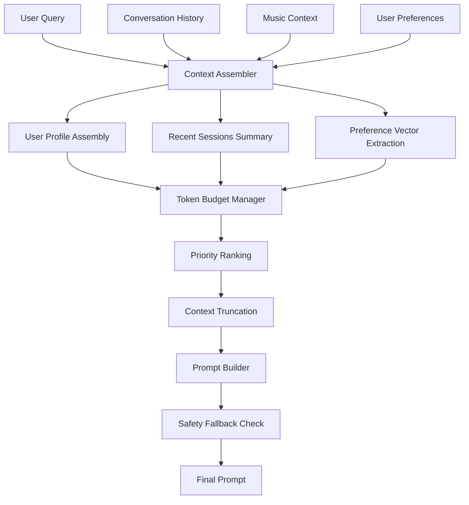

# Chat Context Pipeline

## Purpose
Dynamic context assembly pipeline for LLM interactions with token budgeting, fallback logic, and intelligent context prioritization. This module assembles comprehensive context for conversational music discovery while respecting token limits and maintaining conversation quality.

## Public Interfaces

### Context Assembly Pipeline
```javascript
const { ContextAssembler } = require('./assembleUserProfile');
const { PromptBuilder } = require('./buildPrompt');

// Assemble user profile context
const assembler = new ContextAssembler();
const userProfile = await assembler.assemble(userId, options);

// Build optimized prompt with token budgeting
const promptBuilder = new PromptBuilder();
const prompt = await promptBuilder.build(userProfile, query, options);
```

### Token Budgeting
```javascript
const { TokenBudgetManager } = require('./tokenBudgeting');

// Apply intelligent token budgeting
const budgetManager = new TokenBudgetManager({
  maxTokens: 4000,
  reserveTokens: 500, // Reserve for response
  prioritization: 'conversation-first'
});

const optimizedContext = await budgetManager.optimize(context);
```

## Architecture Flow



## Context Prioritization Strategy

### Priority Levels (High to Low)
1. **Critical**: Current user query, active conversation context
2. **High**: Recent listening history (last 24h), explicit preferences
3. **Medium**: Extended listening history (last week), derived preferences
4. **Low**: Historical patterns, genre trends, community data

### Token Budget Allocation
- **Conversation Context**: 40% of available tokens
- **User Profile**: 30% of available tokens  
- **Music Context**: 20% of available tokens
- **System Instructions**: 10% of available tokens

## Modules

### assembleUserProfile.js
Assembles comprehensive user profile from multiple data sources:
- Spotify listening history analysis
- Explicit user preferences and settings
- Derived preferences from behavior patterns
- Audio feature preference learning
- Social and collaborative signals

### summarizeRecentSessions.js
Summarizes recent chat sessions for conversation continuity:
- Extract key music preferences mentioned
- Identify successful recommendation patterns
- Track conversation themes and mood evolution
- Maintain session context across interactions

### extractPreferenceVectors.js
Extracts and quantifies user music preferences:
- Audio feature preference vectors (energy, valence, etc.)
- Genre affinity scoring with confidence levels
- Artist and style preference mapping
- Temporal preference patterns (time of day, season)
- Activity-based preference profiles

### buildPrompt.js
Builds optimized prompts with token budgeting:
- Template-based prompt construction
- Dynamic context insertion with priority ranking
- Token counting and budget enforcement
- Fallback content selection for over-budget scenarios
- Safety filters and content validation

### tokenBudgeting.js
Manages token budgets and context optimization:
- Accurate token counting for different models
- Intelligent content truncation strategies
- Priority-based context selection
- Fallback content when budgets are exceeded
- Performance monitoring and optimization

## Token Budgeting Algorithms

### Truncation Strategies

#### 1. Conversation-First Strategy
```javascript
// Prioritize recent conversation, truncate historical data
const truncateConversationFirst = (context, maxTokens) => {
  const priorities = [
    { content: context.currentQuery, weight: 1.0 },
    { content: context.recentMessages, weight: 0.9 },
    { content: context.userProfile, weight: 0.7 },
    { content: context.musicContext, weight: 0.5 },
    { content: context.historicalData, weight: 0.3 }
  ];
  
  return applyPriorityTruncation(priorities, maxTokens);
};
```

#### 2. Profile-First Strategy
```javascript
// Prioritize user profile, truncate conversation history
const truncateProfileFirst = (context, maxTokens) => {
  const priorities = [
    { content: context.currentQuery, weight: 1.0 },
    { content: context.userProfile, weight: 0.9 },
    { content: context.musicContext, weight: 0.8 },
    { content: context.recentMessages, weight: 0.6 },
    { content: context.historicalData, weight: 0.3 }
  ];
  
  return applyPriorityTruncation(priorities, maxTokens);
};
```

#### 3. Balanced Strategy
```javascript
// Balance all context types proportionally
const truncateBalanced = (context, maxTokens) => {
  const targetAllocations = {
    currentQuery: 0.15,
    recentMessages: 0.35,
    userProfile: 0.25,
    musicContext: 0.20,
    historicalData: 0.05
  };
  
  return applyProportionalTruncation(context, targetAllocations, maxTokens);
};
```

## Fallback Mechanisms

### Content Fallbacks
1. **Full Context** → **Summarized Context** → **Essential Context** → **Minimal Context**
2. **Detailed History** → **Recent History** → **Key Highlights** → **No History**
3. **Rich Preferences** → **Basic Preferences** → **Genre Only** → **Default Profile**

### Quality Assurance
- Minimum content thresholds for meaningful responses
- Context completeness scoring
- Fallback quality metrics
- User experience impact assessment

## Performance Optimization

### Caching Strategy
- Cache assembled user profiles (5 min TTL)
- Cache recent session summaries (15 min TTL)
- Cache preference vectors (30 min TTL)
- Cache token count estimates for common patterns

### Lazy Loading
- Load detailed context only when needed
- Progressive context enrichment
- On-demand preference computation
- Streaming context assembly for large profiles

## Usage Examples

### Basic Context Assembly
```javascript
const context = await assembleUserProfile(userId, {
  includeHistory: true,
  includeSessions: true,
  maxHistoryDays: 7
});

const prompt = await buildPrompt(context, userQuery, {
  maxTokens: 3000,
  strategy: 'conversation-first',
  includeExamples: true
});
```

### Advanced Token Budgeting
```javascript
const budgetManager = new TokenBudgetManager({
  maxTokens: 4000,
  reserveTokens: 800,
  model: 'gpt-4',
  strategy: 'balanced'
});

const optimizedContext = await budgetManager.optimize({
  userProfile: await assembleUserProfile(userId),
  conversation: await summarizeRecentSessions(userId),
  preferences: await extractPreferenceVectors(userId),
  query: userQuery
});

const prompt = await buildPrompt(optimizedContext, {
  template: 'music-recommendation',
  includeInstructions: true,
  safetyCheck: true
});
```

## Monitoring and Analytics

### Key Metrics
- Average token utilization rate
- Context truncation frequency by strategy
- Prompt quality scores (user feedback correlation)
- Fallback activation rates
- Context assembly latency

### Quality Indicators
- Recommendation acceptance rate by context type
- Conversation continuation success rate
- User satisfaction correlation with context richness
- Response relevance scoring

## Configuration

### Environment Variables
```env
# Context Assembly
CONTEXT_MAX_TOKENS=4000
CONTEXT_RESERVE_TOKENS=500
CONTEXT_STRATEGY=balanced
CONTEXT_CACHE_TTL=300

# Token Budgeting
TOKEN_COUNT_MODEL=gpt-4
TOKEN_SAFETY_MARGIN=100
TOKEN_TRUNCATION_STRATEGY=conversation-first

# Performance
CONTEXT_ASSEMBLY_TIMEOUT=5000
CONTEXT_CACHE_ENABLED=true
CONTEXT_LAZY_LOADING=true
```

## Testing

### Unit Tests
- Token counting accuracy
- Context assembly completeness
- Truncation strategy effectiveness
- Fallback mechanism reliability

### Integration Tests
- End-to-end context pipeline
- Token budget enforcement
- Context quality vs. performance trade-offs
- Real user conversation flows

### Performance Tests
- Context assembly latency under load
- Memory usage with large user profiles
- Cache hit rates and effectiveness
- Concurrent context assembly performance