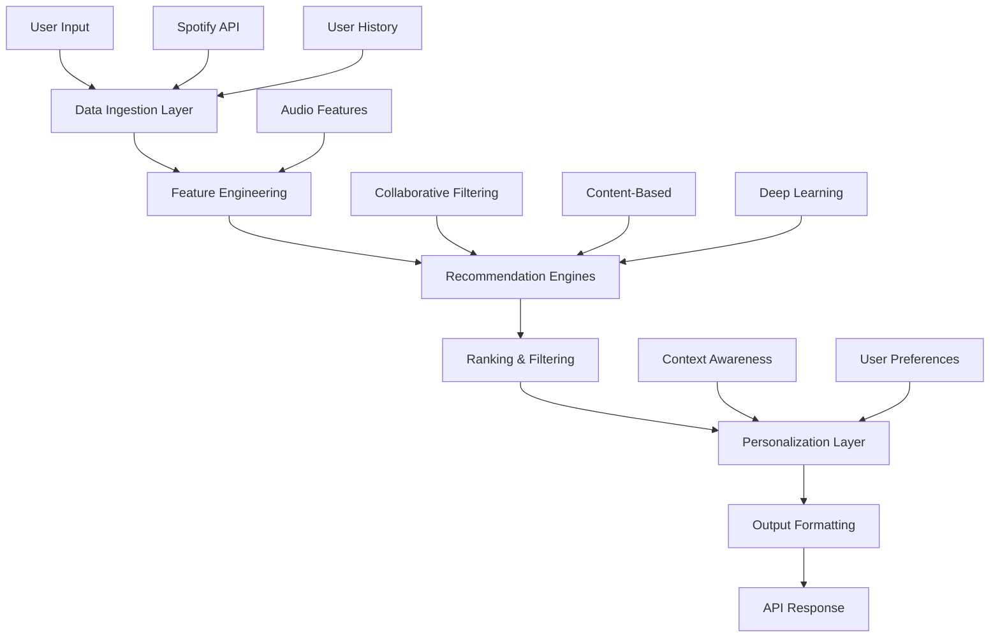

# 🎵 Recommendation Pipeline Skeleton

This document provides a comprehensive skeleton for the EchoTune AI recommendation pipeline, outlining the architecture, data flow, and integration points for building sophisticated music recommendation algorithms.

## 🎯 Overview

The EchoTune AI recommendation pipeline is designed to deliver personalized music recommendations through multiple algorithmic approaches, real-time processing, and continuous learning mechanisms. The pipeline enforces the **"No Mock Policy"** to ensure production-ready algorithms.

## 🏗️ Architecture Overview



### Core Components

1. **Data Ingestion Layer**: Collect and validate input data
2. **Feature Engineering**: Extract and transform musical features
3. **Recommendation Engines**: Multiple algorithmic approaches
4. **Ranking & Filtering**: Score and prioritize recommendations
5. **Personalization Layer**: Apply user-specific customizations
6. **Output Formatting**: Structure recommendations for consumption

## 📊 Data Models

### User Profile Model
```javascript
// src/recommendation/models/UserProfile.js
class UserProfile {
  constructor(userId) {
    this.userId = userId;
    this.preferences = new UserPreferences();
    this.history = new ListeningHistory();
    this.features = new UserFeatures();
  }
  
  async loadFromDatabase() {
    // Load user data from MongoDB
    // NO_MOCK: Use real database operations
    const userData = await UserModel.findById(this.userId);
    if (!userData) {
      throw new Error(`User ${this.userId} not found`);
    }
    return userData;
  }
}

class UserPreferences {
  constructor() {
    this.genres = [];           // Preferred genres
    this.artists = [];          // Favorite artists
    this.audioFeatures = {};    // Preferred audio characteristics
    this.excludedContent = [];  // Content to avoid
  }
}

class ListeningHistory {
  constructor() {
    this.recentTracks = [];     // Recently played tracks
    this.topTracks = [];        // Most played tracks
    this.skipPatterns = [];     // Track skip behavior
    this.sessionData = [];      // Listening session information
  }
}
```

### Track Feature Model
```javascript
// src/recommendation/models/TrackFeatures.js
class TrackFeatures {
  constructor(trackId) {
    this.trackId = trackId;
    this.metadata = new TrackMetadata();
    this.audioFeatures = new AudioFeatures();
    this.contextualFeatures = new ContextualFeatures();
  }
  
  async enrichFromSpotify() {
    // NO_MOCK: Use real Spotify API
    const audioFeatures = await spotifyApi.getAudioFeatures(this.trackId);
    const trackInfo = await spotifyApi.getTrack(this.trackId);
    
    this.audioFeatures = new AudioFeatures(audioFeatures);
    this.metadata = new TrackMetadata(trackInfo);
  }
}

class AudioFeatures {
  constructor(spotifyFeatures = {}) {
    this.acousticness = spotifyFeatures.acousticness || 0;
    this.danceability = spotifyFeatures.danceability || 0;
    this.energy = spotifyFeatures.energy || 0;
    this.instrumentalness = spotifyFeatures.instrumentalness || 0;
    this.liveness = spotifyFeatures.liveness || 0;
    this.loudness = spotifyFeatures.loudness || 0;
    this.speechiness = spotifyFeatures.speechiness || 0;
    this.tempo = spotifyFeatures.tempo || 0;
    this.valence = spotifyFeatures.valence || 0;
  }
}
```

## 🤖 Recommendation Engine Classes

### Base Recommendation Engine
```javascript
// src/recommendation/engines/BaseRecommendationEngine.js
class BaseRecommendationEngine {
  constructor(config = {}) {
    this.config = config;
    this.isInitialized = false;
  }
  
  async initialize() {
    // Initialize engine-specific components
    // NO_MOCK: Load real models and data
    throw new Error('initialize() must be implemented by subclass');
  }
  
  async generateRecommendations(userId, options = {}) {
    if (!this.isInitialized) {
      await this.initialize();
    }
    
    // NO_MOCK: Generate real recommendations
    throw new Error('generateRecommendations() must be implemented by subclass');
  }
  
  async validateRecommendations(recommendations) {
    // Validate recommendation quality and authenticity
    if (!Array.isArray(recommendations)) {
      throw new Error('Recommendations must be an array');
    }
    
    for (const rec of recommendations) {
      if (!rec.trackId || !rec.score) {
        throw new Error('Invalid recommendation format');
      }
      
      // NO_MOCK: Validate against real track database
      const trackExists = await this.validateTrackExists(rec.trackId);
      if (!trackExists) {
        throw new Error(`Invalid track ID: ${rec.trackId}`);
      }
    }
    
    return true;
  }
  
  async validateTrackExists(trackId) {
    // NO_MOCK: Check against real Spotify API or database
    try {
      const track = await spotifyApi.getTrack(trackId);
      return !!track;
    } catch (error) {
      return false;
    }
  }
}
```

### Collaborative Filtering Engine
```javascript
// src/recommendation/engines/CollaborativeFilteringEngine.js
class CollaborativeFilteringEngine extends BaseRecommendationEngine {
  constructor(config = {}) {
    super(config);
    this.userItemMatrix = null;
    this.similarityMatrix = null;
  }
  
  async initialize() {
    // NO_MOCK: Load real user-item interaction data
    const interactionData = await this.loadUserInteractions();
    this.userItemMatrix = this.buildUserItemMatrix(interactionData);
    this.similarityMatrix = this.calculateUserSimilarity();
    this.isInitialized = true;
  }
  
  async loadUserInteractions() {
    // NO_MOCK: Query real database for user interactions
    const query = {
      collection: 'user_interactions',
      filter: { timestamp: { $gte: new Date(Date.now() - 30 * 24 * 60 * 60 * 1000) } }
    };
    
    return await database.query(query);
  }
  
  buildUserItemMatrix(interactions) {
    // Build sparse user-item interaction matrix
    const matrix = new Map();
    
    for (const interaction of interactions) {
      const userKey = interaction.userId;
      const trackKey = interaction.trackId;
      const rating = this.calculateImplicitRating(interaction);
      
      if (!matrix.has(userKey)) {
        matrix.set(userKey, new Map());
      }
      
      matrix.get(userKey).set(trackKey, rating);
    }
    
    return matrix;
  }
  
  calculateImplicitRating(interaction) {
    // Convert implicit feedback to rating
    // NO_MOCK: Use real behavioral signals
    let rating = 0;
    
    // Play completion rate
    if (interaction.playDuration && interaction.trackDuration) {
      const completionRate = interaction.playDuration / interaction.trackDuration;
      rating += completionRate * 2;
    }
    
    // Explicit actions
    if (interaction.liked) rating += 3;
    if (interaction.saved) rating += 2;
    if (interaction.shared) rating += 1;
    if (interaction.skipped) rating -= 1;
    
    return Math.max(0, Math.min(5, rating));
  }
  
  async generateRecommendations(userId, options = {}) {
    await super.generateRecommendations(userId, options);
    
    const { count = 20, excludeHeard = true } = options;
    const userVector = this.userItemMatrix.get(userId);
    
    if (!userVector) {
      // Cold start problem - use popularity-based recommendations
      return await this.generatePopularityBasedRecommendations(count);
    }
    
    const similarities = this.findSimilarUsers(userId);
    const recommendations = this.generateFromSimilarUsers(userId, similarities, count);
    
    if (excludeHeard) {
      return this.filterHeardTracks(userId, recommendations);
    }
    
    return recommendations;
  }
  
  findSimilarUsers(userId) {
    // Find users with similar preferences
    // NO_MOCK: Use real similarity calculations
    const userVector = this.userItemMatrix.get(userId);
    const similarities = [];
    
    for (const [otherUserId, otherVector] of this.userItemMatrix) {
      if (otherUserId === userId) continue;
      
      const similarity = this.calculateCosineSimilarity(userVector, otherVector);
      if (similarity > 0.1) { // Threshold for similarity
        similarities.push({ userId: otherUserId, similarity });
      }
    }
    
    return similarities.sort((a, b) => b.similarity - a.similarity).slice(0, 50);
  }
  
  calculateCosineSimilarity(vectorA, vectorB) {
    // Calculate cosine similarity between user vectors
    const commonItems = new Set();
    
    for (const item of vectorA.keys()) {
      if (vectorB.has(item)) {
        commonItems.add(item);
      }
    }
    
    if (commonItems.size === 0) return 0;
    
    let dotProduct = 0;
    let normA = 0;
    let normB = 0;
    
    for (const item of commonItems) {
      const ratingA = vectorA.get(item);
      const ratingB = vectorB.get(item);
      
      dotProduct += ratingA * ratingB;
      normA += ratingA * ratingA;
      normB += ratingB * ratingB;
    }
    
    if (normA === 0 || normB === 0) return 0;
    
    return dotProduct / (Math.sqrt(normA) * Math.sqrt(normB));
  }
}
```

### Content-Based Engine
```javascript
// src/recommendation/engines/ContentBasedEngine.js
class ContentBasedEngine extends BaseRecommendationEngine {
  constructor(config = {}) {
    super(config);
    this.trackFeatures = new Map();
    this.genreEmbeddings = null;
  }
  
  async initialize() {
    // NO_MOCK: Load real track features and embeddings
    await this.loadTrackFeatures();
    await this.loadGenreEmbeddings();
    this.isInitialized = true;
  }
  
  async loadTrackFeatures() {
    // NO_MOCK: Load from real database or cache
    const features = await database.query({
      collection: 'track_features',
      projection: { trackId: 1, audioFeatures: 1, metadata: 1 }
    });
    
    for (const feature of features) {
      this.trackFeatures.set(feature.trackId, feature);
    }
  }
  
  async generateRecommendations(userId, options = {}) {
    await super.generateRecommendations(userId, options);
    
    const userProfile = await this.buildUserProfile(userId);
    const candidates = await this.findCandidateTracks(userProfile, options);
    const scored = this.scoreTracksByContent(userProfile, candidates);
    
    return scored
      .sort((a, b) => b.score - a.score)
      .slice(0, options.count || 20);
  }
  
  async buildUserProfile(userId) {
    // Build user preference profile from listening history
    // NO_MOCK: Use real user data
    const history = await database.query({
      collection: 'listening_history',
      filter: { userId, timestamp: { $gte: new Date(Date.now() - 90 * 24 * 60 * 60 * 1000) } }
    });
    
    const profile = {
      audioFeaturePreferences: this.calculateAudioFeaturePreferences(history),
      genrePreferences: this.calculateGenrePreferences(history),
      artistPreferences: this.calculateArtistPreferences(history)
    };
    
    return profile;
  }
  
  calculateAudioFeaturePreferences(history) {
    // Calculate user's preferred audio characteristics
    const features = {
      acousticness: [],
      danceability: [],
      energy: [],
      instrumentalness: [],
      liveness: [],
      loudness: [],
      speechiness: [],
      tempo: [],
      valence: []
    };
    
    for (const play of history) {
      const trackFeatures = this.trackFeatures.get(play.trackId);
      if (!trackFeatures) continue;
      
      for (const [feature, value] of Object.entries(trackFeatures.audioFeatures)) {
        if (features[feature]) {
          // Weight by play duration and user engagement
          const weight = this.calculateEngagementWeight(play);
          features[feature].push({ value, weight });
        }
      }
    }
    
    // Calculate weighted preferences
    const preferences = {};
    for (const [feature, values] of Object.entries(features)) {
      if (values.length === 0) continue;
      
      const weightedSum = values.reduce((sum, item) => sum + (item.value * item.weight), 0);
      const totalWeight = values.reduce((sum, item) => sum + item.weight, 0);
      
      preferences[feature] = {
        mean: weightedSum / totalWeight,
        variance: this.calculateWeightedVariance(values, weightedSum / totalWeight)
      };
    }
    
    return preferences;
  }
  
  calculateEngagementWeight(play) {
    // Calculate engagement weight based on user behavior
    // NO_MOCK: Use real behavioral signals
    let weight = 1.0;
    
    if (play.completed) weight *= 1.5;
    if (play.liked) weight *= 2.0;
    if (play.saved) weight *= 1.8;
    if (play.shared) weight *= 1.3;
    if (play.skipped && play.playDuration < 30000) weight *= 0.3;
    
    return weight;
  }
}
```

## 🎯 Feature Engineering Pipeline

### Audio Feature Extractor
```javascript
// src/recommendation/features/AudioFeatureExtractor.js
class AudioFeatureExtractor {
  constructor() {
    this.spotifyApi = new SpotifyApiClient();
  }
  
  async extractFeatures(trackId) {
    // NO_MOCK: Extract real audio features from Spotify
    const [audioFeatures, trackInfo] = await Promise.all([
      this.spotifyApi.getAudioFeatures(trackId),
      this.spotifyApi.getTrack(trackId)
    ]);
    
    return {
      basic: this.extractBasicFeatures(audioFeatures),
      derived: this.extractDerivedFeatures(audioFeatures),
      contextual: this.extractContextualFeatures(trackInfo),
      temporal: this.extractTemporalFeatures(audioFeatures)
    };
  }
  
  extractBasicFeatures(audioFeatures) {
    // Direct Spotify audio features
    return {
      acousticness: audioFeatures.acousticness,
      danceability: audioFeatures.danceability,
      energy: audioFeatures.energy,
      instrumentalness: audioFeatures.instrumentalness,
      liveness: audioFeatures.liveness,
      loudness: audioFeatures.loudness,
      speechiness: audioFeatures.speechiness,
      tempo: audioFeatures.tempo,
      valence: audioFeatures.valence
    };
  }
  
  extractDerivedFeatures(audioFeatures) {
    // Derived features for better recommendations
    return {
      energyDanceability: audioFeatures.energy * audioFeatures.danceability,
      valenceEnergy: audioFeatures.valence * audioFeatures.energy,
      tempoCategory: this.categorizetempo(audioFeatures.tempo),
      moodCategory: this.categorizeMood(audioFeatures.valence, audioFeatures.energy),
      acousticCategory: this.categorizeAcoustic(audioFeatures.acousticness)
    };
  }
  
  categorizeempo(tempo) {
    if (tempo < 90) return 'slow';
    if (tempo < 120) return 'moderate';
    if (tempo < 140) return 'upbeat';
    return 'fast';
  }
  
  categorizeMood(valence, energy) {
    if (valence > 0.6 && energy > 0.6) return 'happy_energetic';
    if (valence > 0.6 && energy < 0.4) return 'happy_calm';
    if (valence < 0.4 && energy > 0.6) return 'aggressive';
    if (valence < 0.4 && energy < 0.4) return 'sad_calm';
    return 'neutral';
  }
}
```

## 🔄 Recommendation Pipeline Orchestrator

### Main Pipeline Class
```javascript
// src/recommendation/pipeline/RecommendationPipeline.js
class RecommendationPipeline {
  constructor() {
    this.engines = {
      collaborative: new CollaborativeFilteringEngine(),
      contentBased: new ContentBasedEngine(),
      popularity: new PopularityBasedEngine(),
      deepLearning: new DeepLearningEngine()
    };
    
    this.rankingModel = new RankingModel();
    this.personalizationLayer = new PersonalizationLayer();
  }
  
  async initialize() {
    // Initialize all engines
    // NO_MOCK: Initialize with real models and data
    await Promise.all(
      Object.values(this.engines).map(engine => engine.initialize())
    );
    
    await this.rankingModel.initialize();
    await this.personalizationLayer.initialize();
  }
  
  async generateRecommendations(userId, options = {}) {
    const {
      count = 20,
      engines = ['collaborative', 'contentBased'],
      context = {},
      excludeHeard = true
    } = options;
    
    // Generate recommendations from multiple engines
    const engineResults = await this.runEngines(userId, engines, {
      count: count * 2, // Generate more for better filtering
      context,
      excludeHeard
    });
    
    // Combine and rank results
    const combined = this.combineResults(engineResults);
    const ranked = await this.rankingModel.rank(combined, userId, context);
    
    // Apply personalization
    const personalized = await this.personalizationLayer.personalize(
      ranked, 
      userId, 
      context
    );
    
    // Final filtering and formatting
    const filtered = this.applyFinalFilters(personalized, userId, options);
    
    // Validate recommendations
    await this.validateRecommendations(filtered);
    
    return filtered.slice(0, count);
  }
  
  async runEngines(userId, engines, options) {
    const results = {};
    
    const enginePromises = engines.map(async engineName => {
      if (!this.engines[engineName]) {
        throw new Error(`Unknown engine: ${engineName}`);
      }
      
      try {
        const recommendations = await this.engines[engineName]
          .generateRecommendations(userId, options);
        results[engineName] = recommendations;
      } catch (error) {
        console.error(`Engine ${engineName} failed:`, error);
        results[engineName] = [];
      }
    });
    
    await Promise.all(enginePromises);
    return results;
  }
  
  combineResults(engineResults) {
    // Combine results from multiple engines with weighted scoring
    const trackScores = new Map();
    const engineWeights = {
      collaborative: 0.4,
      contentBased: 0.3,
      popularity: 0.2,
      deepLearning: 0.1
    };
    
    for (const [engineName, recommendations] of Object.entries(engineResults)) {
      const weight = engineWeights[engineName] || 0.1;
      
      recommendations.forEach((rec, index) => {
        const positionScore = 1 - (index / recommendations.length);
        const weightedScore = rec.score * weight * positionScore;
        
        if (trackScores.has(rec.trackId)) {
          trackScores.get(rec.trackId).score += weightedScore;
          trackScores.get(rec.trackId).engines.push(engineName);
        } else {
          trackScores.set(rec.trackId, {
            trackId: rec.trackId,
            score: weightedScore,
            engines: [engineName],
            originalScores: { [engineName]: rec.score }
          });
        }
      });
    }
    
    return Array.from(trackScores.values())
      .sort((a, b) => b.score - a.score);
  }
  
  async validateRecommendations(recommendations) {
    // NO_MOCK: Validate against real data
    for (const rec of recommendations) {
      // Validate track exists
      const trackExists = await this.validateTrackExists(rec.trackId);
      if (!trackExists) {
        throw new Error(`Invalid recommendation: track ${rec.trackId} not found`);
      }
      
      // Validate score is reasonable
      if (rec.score < 0 || rec.score > 1) {
        throw new Error(`Invalid recommendation score: ${rec.score}`);
      }
      
      // Validate required fields
      if (!rec.trackId || typeof rec.score !== 'number') {
        throw new Error('Invalid recommendation format');
      }
    }
  }
  
  async validateTrackExists(trackId) {
    // NO_MOCK: Check against real Spotify API
    try {
      const track = await spotifyApi.getTrack(trackId);
      return !!track && !!track.id;
    } catch (error) {
      return false;
    }
  }
}
```

## 📊 Performance Monitoring

### Recommendation Metrics
```javascript
// src/recommendation/monitoring/RecommendationMetrics.js
class RecommendationMetrics {
  constructor() {
    this.metrics = new MetricsCollector();
  }
  
  async trackRecommendationRequest(userId, options, startTime) {
    const duration = Date.now() - startTime;
    
    await this.metrics.increment('recommendations.requests.total');
    await this.metrics.histogram('recommendations.latency', duration);
    await this.metrics.gauge('recommendations.active_users', await this.getActiveUsers());
  }
  
  async trackRecommendationQuality(recommendations, userId) {
    // NO_MOCK: Track real quality metrics
    const diversity = this.calculateDiversity(recommendations);
    const novelty = await this.calculateNovelty(recommendations, userId);
    const coverage = this.calculateCoverage(recommendations);
    
    await this.metrics.gauge('recommendations.quality.diversity', diversity);
    await this.metrics.gauge('recommendations.quality.novelty', novelty);
    await this.metrics.gauge('recommendations.quality.coverage', coverage);
  }
  
  calculateDiversity(recommendations) {
    // Calculate recommendation diversity
    const genres = new Set();
    const artists = new Set();
    
    for (const rec of recommendations) {
      if (rec.genre) genres.add(rec.genre);
      if (rec.artist) artists.add(rec.artist);
    }
    
    return {
      genreDiversity: genres.size / recommendations.length,
      artistDiversity: artists.size / recommendations.length
    };
  }
}
```

## 🔗 Integration Points

### API Integration
```javascript
// src/recommendation/api/RecommendationController.js
class RecommendationController {
  constructor() {
    this.pipeline = new RecommendationPipeline();
    this.cache = new RedisCache();
    this.metrics = new RecommendationMetrics();
  }
  
  async getRecommendations(req, res) {
    const startTime = Date.now();
    const { userId } = req.params;
    const options = this.parseOptions(req.query);
    
    try {
      // Check cache first
      const cacheKey = this.generateCacheKey(userId, options);
      let recommendations = await this.cache.get(cacheKey);
      
      if (!recommendations) {
        // Generate new recommendations
        // NO_MOCK: Use real pipeline
        recommendations = await this.pipeline.generateRecommendations(userId, options);
        
        // Cache for future requests
        await this.cache.set(cacheKey, recommendations, { ttl: 300 }); // 5 minutes
      }
      
      // Track metrics
      await this.metrics.trackRecommendationRequest(userId, options, startTime);
      await this.metrics.trackRecommendationQuality(recommendations, userId);
      
      res.json({
        status: 'success',
        data: {
          recommendations,
          metadata: {
            userId,
            count: recommendations.length,
            options,
            cached: !!recommendations.cached,
            generatedAt: new Date().toISOString()
          }
        }
      });
      
    } catch (error) {
      console.error('Recommendation generation failed:', error);
      await this.metrics.increment('recommendations.errors.total');
      
      res.status(500).json({
        status: 'error',
        message: 'Failed to generate recommendations',
        error: process.env.NODE_ENV === 'development' ? error.message : undefined
      });
    }
  }
}
```

## 🧪 Testing Framework

### Recommendation Testing
```javascript
// tests/recommendation/RecommendationPipeline.test.js
describe('RecommendationPipeline', () => {
  let pipeline;
  let testUserId;
  
  beforeAll(async () => {
    pipeline = new RecommendationPipeline();
    await pipeline.initialize();
    testUserId = 'test-user-' + Date.now();
  });
  
  describe('generateRecommendations', () => {
    it('should generate valid recommendations for existing user', async () => {
      // Create test user with listening history
      await createTestUserWithHistory(testUserId);
      
      const recommendations = await pipeline.generateRecommendations(testUserId, {
        count: 10,
        engines: ['collaborative', 'contentBased']
      });
      
      expect(recommendations).toBeDefined();
      expect(recommendations).toHaveLength(10);
      
      // Validate recommendation structure
      for (const rec of recommendations) {
        expect(rec).toHaveProperty('trackId');
        expect(rec).toHaveProperty('score');
        expect(typeof rec.score).toBe('number');
        expect(rec.score).toBeGreaterThanOrEqual(0);
        expect(rec.score).toBeLessThanOrEqual(1);
        
        // NO_MOCK: Validate against real Spotify API
        const trackExists = await validateTrackExists(rec.trackId);
        expect(trackExists).toBe(true);
      }
    });
    
    it('should handle cold start users', async () => {
      const newUserId = 'new-user-' + Date.now();
      
      const recommendations = await pipeline.generateRecommendations(newUserId, {
        count: 10
      });
      
      expect(recommendations).toBeDefined();
      expect(recommendations.length).toBeGreaterThan(0);
      
      // Should fall back to popularity-based recommendations
      expect(recommendations.every(rec => rec.engines.includes('popularity'))).toBe(true);
    });
  });
});
```

## 📚 Related Resources

- [Agent Operations Guide](./AGENT_OPERATIONS.md)
- [Testing Policy](./TESTING_POLICY.md)
- [MCP Server Inventory](./MCP_SERVER_INVENTORY.md)
- [NO_MOCK Validation Script](../scripts/validate-no-mock.js)

---

**Last Updated**: Auto-generated by Recommendation Pipeline Documentation System
**Version**: 1.0.0
**Owner**: EchoTune AI Recommendation Team