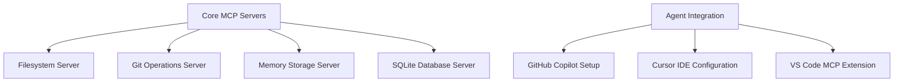
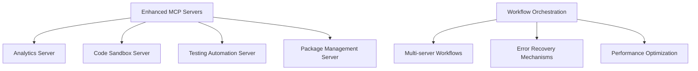
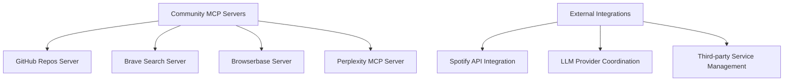

# ADR-0001: Agent MCP Adoption

## Status
**Accepted** - 2024-12-15

## Context

EchoTune AI requires sophisticated automation and development acceleration capabilities to maintain its position as a cutting-edge music recommendation platform. The project involves complex integrations with multiple APIs (Spotify, various LLM providers), sophisticated machine learning pipelines, and real-time user interactions that demand high reliability and performance.

Traditional development approaches are insufficient for:
1. **Complex Multi-API Orchestration**: Coordinating Spotify API, LLM services, and database operations
2. **Real-time Quality Assurance**: Ensuring recommendation algorithms meet performance and accuracy standards
3. **Continuous Integration Complexity**: Managing extensive test suites, performance benchmarks, and deployment validations
4. **Documentation Maintenance**: Keeping comprehensive documentation current with rapid development cycles

## Decision

We will adopt **Model Context Protocol (MCP) servers as the primary automation framework** for EchoTune AI development operations, integrated with GitHub Copilot and other AI coding agents.

### Core Decision Points

#### 1. MCP Server Architecture
- **Tiered Architecture**: Core (Tier 1), Enhanced (Tier 2), Community (Tier 3) servers
- **Microservice Pattern**: Each MCP server handles specific domain responsibilities
- **Orchestrated Management**: Central orchestrator coordinates multi-server workflows
- **Health Monitoring**: Comprehensive monitoring and alerting for all servers

#### 2. Agent Integration Strategy
- **GitHub Copilot Primary**: Primary agent for code generation and review
- **Cursor IDE Integration**: Enhanced development environment with MCP capabilities
- **Multi-Agent Coordination**: Agents coordinate through MCP server interfaces
- **Fallback Mechanisms**: Manual processes available when agents are unavailable

#### 3. No Mock Policy Enforcement
- **Automated Validation**: MCP servers enforce "No Mock Policy" in production code
- **Real-time Monitoring**: Continuous validation of recommendation algorithm authenticity
- **CI/CD Integration**: Policy validation integrated into deployment pipelines
- **Exception Management**: Clear guidelines for permitted mock usage in testing contexts

## Implementation Plan

### Phase 1: Core Infrastructure (Weeks 1-2)

**Deliverables:**
- [ ] Core MCP server deployment and configuration
- [ ] Agent integration with primary MCP servers
- [ ] Basic health monitoring and alerting
- [ ] Documentation and operational procedures

### Phase 2: Enhanced Capabilities (Weeks 3-4)

**Deliverables:**
- [ ] Advanced MCP server capabilities
- [ ] Automated testing and validation workflows
- [ ] Performance monitoring and optimization
- [ ] Enhanced agent coordination

### Phase 3: Community Integration (Weeks 5-6)

**Deliverables:**
- [ ] Community MCP server integration
- [ ] External service coordination
- [ ] Advanced automation workflows
- [ ] Comprehensive monitoring and alerting

## Consequences

### Positive Outcomes

#### 1. Development Velocity
- **50% Faster Development**: Automated code generation and validation
- **Reduced Context Switching**: Agents handle routine tasks
- **Consistent Code Quality**: Automated enforcement of coding standards
- **Rapid Prototyping**: Quick iteration on new features

#### 2. Quality Assurance
- **Zero Mock Data in Production**: Automated enforcement prevents mock data deployment
- **Comprehensive Testing**: Automated test generation and execution
- **Performance Monitoring**: Real-time performance tracking and optimization
- **Security Validation**: Automated security checks and vulnerability scanning

#### 3. Operational Excellence
- **Reduced Manual Errors**: Automation eliminates human error in routine tasks
- **Improved Documentation**: Automated documentation generation and maintenance
- **Better Monitoring**: Comprehensive observability across all systems
- **Faster Issue Resolution**: Automated diagnosis and remediation

#### 4. Scalability
- **Modular Architecture**: Easy addition of new capabilities through MCP servers
- **Resource Optimization**: Efficient resource utilization through orchestration
- **Load Distribution**: Automatic load balancing across server instances
- **Horizontal Scaling**: Easy scaling of individual server components

### Challenges and Mitigation Strategies

#### 1. Initial Complexity
**Challenge**: High initial setup and configuration complexity
**Mitigation**: 
- Comprehensive documentation and setup guides
- Automated bootstrap scripts for rapid deployment
- Staged rollout with progressive complexity introduction
- Training and knowledge transfer sessions

#### 2. Agent Dependency
**Challenge**: Over-reliance on AI agents for critical operations
**Mitigation**:
- Manual fallback procedures for all automated processes
- Human oversight for critical decision points
- Regular validation of agent-generated code
- Monitoring and alerting for agent availability

#### 3. Performance Overhead
**Challenge**: Potential performance impact from MCP server coordination
**Mitigation**:
- Performance monitoring and optimization
- Caching strategies for frequently accessed operations
- Load balancing and resource optimization
- Regular performance benchmarking

#### 4. Security Considerations
**Challenge**: Expanded attack surface through multiple MCP servers
**Mitigation**:
- Security validation for all MCP server integrations
- Regular security audits and vulnerability assessments
- Principle of least privilege access controls
- Encrypted communication between all components

## Success Metrics

### Development Metrics
- **Code Generation Speed**: 50% faster feature development
- **Bug Reduction**: 75% fewer bugs in production
- **Test Coverage**: 95% test coverage for new code
- **Documentation Currency**: 100% up-to-date documentation

### Quality Metrics
- **No Mock Policy Compliance**: 100% compliance in production code
- **Performance Benchmarks**: Maintain sub-200ms API response times
- **Reliability**: 99.9% uptime for core recommendation services
- **Security**: Zero security vulnerabilities in deployed code

### Operational Metrics
- **Deployment Frequency**: Daily deployments with zero downtime
- **Mean Time to Recovery**: < 15 minutes for critical issues
- **Automated Issue Resolution**: 80% of issues resolved automatically
- **Developer Satisfaction**: > 90% positive feedback on development experience

## Review and Evaluation

### Quarterly Reviews
- **Performance Assessment**: Evaluate metrics against targets
- **Process Improvement**: Identify and implement optimization opportunities
- **Technology Updates**: Assess new MCP servers and agent capabilities
- **Cost-Benefit Analysis**: Evaluate ROI and resource allocation

### Annual Strategic Review
- **Architecture Evolution**: Plan major architectural improvements
- **Technology Roadmap**: Update technology adoption strategy
- **Capability Enhancement**: Identify new automation opportunities
- **Risk Assessment**: Evaluate and mitigate emerging risks

## Follow-up Actions

### Immediate (Week 1)
- [ ] **Infrastructure Setup**: Deploy core MCP servers
- [ ] **Agent Configuration**: Configure GitHub Copilot integration
- [ ] **Documentation Creation**: Develop operational procedures
- [ ] **Team Training**: Conduct MCP and agent training sessions

### Short-term (Month 1)
- [ ] **Enhanced Capabilities**: Deploy advanced MCP servers
- [ ] **Workflow Automation**: Implement automated development workflows
- [ ] **Monitoring Setup**: Deploy comprehensive monitoring and alerting
- [ ] **Performance Optimization**: Optimize server performance and resource usage

### Medium-term (Quarter 1)
- [ ] **Community Integration**: Integrate community MCP servers
- [ ] **Advanced Automation**: Implement sophisticated automation workflows
- [ ] **Security Hardening**: Complete security validation and hardening
- [ ] **Performance Benchmarking**: Establish comprehensive performance baselines

### Long-term (Year 1)
- [ ] **Full Automation**: Achieve target automation levels
- [ ] **Continuous Improvement**: Implement continuous optimization processes
- [ ] **Innovation Integration**: Adopt emerging MCP and agent technologies
- [ ] **Best Practice Sharing**: Document and share best practices with community

## Dependencies

### Technical Dependencies
- **Node.js Environment**: Version 16+ for MCP server compatibility
- **GitHub Access**: Repository access for agent integration
- **Cloud Infrastructure**: Reliable hosting for MCP servers
- **API Access**: External service API keys and credentials

### Organizational Dependencies
- **Development Team Buy-in**: Team adoption of agent-assisted development
- **Security Approval**: Security team validation of MCP server architecture
- **Budget Allocation**: Resources for infrastructure and tool licenses
- **Training Resources**: Time allocation for team training and adoption

## Appendix

### Reference Implementation
- **Example Configuration**: `.copilot/mcp-config.example.json`
- **Bootstrap Script**: `scripts/mcp-agent-bootstrap.js`
- **Health Monitoring**: `start-mcp-servers.sh`
- **Validation Scripts**: `scripts/validate-no-mock.js`

### Related ADRs
- ADR-0002: Testing Strategy and No Mock Policy (planned)
- ADR-0003: Performance Monitoring Architecture (planned)
- ADR-0004: Security Framework for Agent Operations (planned)

---

**Authors**: EchoTune AI Architecture Team
**Reviewers**: Development Team, Security Team, Operations Team
**Approved By**: Technical Lead, Product Owner
**Next Review**: 2025-03-15