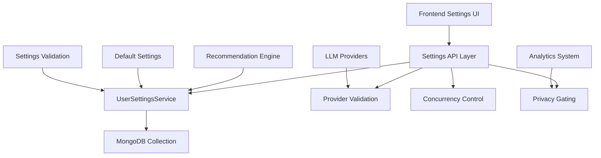

# Phase 3: User Settings System Specification

**Status**: Implementation complete (pending final docs alignment)  
**Implementation PR**: [#37 - feat: Implement Phase 3 User Settings & Backend Integration with Optimistic Concurrency](https://github.com/primoscope/Spotify-echo/pull/37)  
**Documentation PR**: This PR - Documentation & alignment for Phase 3  
**Planning/Tracking PR**: [#35 - Auto-closes when #37 merges](https://github.com/primoscope/Spotify-echo/pull/35)

## Overview

Phase 3 introduces a comprehensive user settings system that enables personalized music discovery through configurable LLM providers, recommendation strategy weights, privacy controls, and playlist defaults. The system provides a robust backend API with optimistic concurrency control, comprehensive validation, and fallback mechanisms.

## Architecture

### Core Components



### Data Model

```typescript
interface UserSettings {
  userId: string;
  llmProvider: 'openai' | 'gemini' | 'openrouter' | 'mock';
  llmModel: string;
  providerOverride?: string; // Optional override for fallback scenarios
  strategyWeights: {
    collaborative: number; // 0.0 - 1.0
    content: number;       // 0.0 - 1.0  
    semantic: number;      // 0.0 - 1.0
    diversity: number;     // 0.0 - 1.0
  };
  privacy: {
    storeHistory: boolean;
    shareAnalytics: boolean;
    enableTelemetry: boolean;
  };
  playlistDefaults: {
    public: boolean;
    descriptionTemplate: string;
    autoSync: boolean;
  };
  preferences: {
    maxRecommendations: number;
    enableExplanations: boolean;
    autoRefresh: boolean;
    compactMode: boolean;
  };
  createdAt: Date;
  updatedAt: Date;
}
```

## API Endpoints

### Canonical Endpoints (/api/settings)

| Method | Endpoint | Description | Auth Required |
|--------|----------|-------------|---------------|
| GET | `/api/settings` | Get user settings (with defaults if new user) | Yes |
| PUT | `/api/settings` | Update user settings with optimistic concurrency | Yes |
| PATCH | `/api/settings` | Partially update user settings | Yes |
| DELETE | `/api/settings` | Reset settings to defaults | Yes |
| GET | `/api/settings/defaults` | Get default settings template | No |
| GET | `/api/providers/status` | Get LLM provider availability and health | No |
| GET | `/api/settings/bulk` | Get multiple user settings (admin) | Admin |
| GET | `/api/settings/stats` | Get usage statistics (admin) | Admin |

### Legacy Compatibility Endpoints (/api/user-settings)

All `/api/user-settings/*` endpoints remain available for backward compatibility but are considered legacy. They route to the same handlers as the canonical endpoints.

## Key Features

### 1. Optimistic Concurrency Control

**Primary Method**: `updatedAt` field in request body
```json
{
  "llmProvider": "openai",
  "updatedAt": "2024-01-15T10:30:00.000Z"
}
```

**Legacy Method**: `If-Unmodified-Since` header (optional fallback)
```http
If-Unmodified-Since: Mon, 15 Jan 2024 10:30:00 GMT
```

**Conflict Response** (409):
```json
{
  "error": "VERSION_CONFLICT",
  "message": "Settings were modified by another process. Please refresh and try again.",
  "serverVersion": "2024-01-15T10:35:00.000Z",
  "serverState": { /* current settings */ }
}
```

### 2. Provider Override & Fallback

When a user's selected LLM provider is unavailable:
- System checks provider status via health endpoints
- If provider fails, system selects best available fallback
- `providerOverride` field ignored during fallback selection
- User receives warning in response about fallback usage
- Logs contain provider fallback events for monitoring

```json
{
  "success": true,
  "data": { /* settings */ },
  "warnings": [{
    "code": "PROVIDER_FALLBACK",
    "message": "Selected provider 'openai' unavailable, using 'gemini' as fallback",
    "fallbackProvider": "gemini"
  }]
}
```

### 3. Privacy Gating

When `privacy.storeHistory = false`:
- Recommendation events are not persisted to analytics
- User listening history collection is skipped
- Temporary session data may be used for current session only
- Analytics aggregation excludes privacy-opted-out users

### 4. Strategy Weights Normalization

User-provided weights are automatically normalized:
- Weights must sum to 1.0 (validated and normalized on server)
- Individual weights constrained to 0.0 - 1.0 range
- Default distribution: `{collaborative: 0.3, content: 0.3, semantic: 0.3, diversity: 0.1}`

### 5. Template Sanitization

Playlist description templates are sanitized:
- HTML tags stripped for security
- Maximum length enforced (200 characters)
- Placeholder validation for dynamic content
- Default: "AI-generated playlist by EchoTune"

## Error Response Schema

All endpoints return consistent JSON error responses:

```json
{
  "error": "ERROR_CODE",
  "message": "Human-readable error description",
  "details": { /* Optional additional context */ },
  "timestamp": "2024-01-15T10:30:00.000Z"
}
```

**Common Error Codes**:
- `AUTHENTICATION_REQUIRED` (401)
- `AUTHORIZATION_FAILED` (403) 
- `VALIDATION_ERROR` (400)
- `VERSION_CONFLICT` (409)
- `INTERNAL_SERVER_ERROR` (500)

## Default Settings

```json
{
  "llmProvider": "openai",
  "llmModel": "gpt-4o-mini", 
  "strategyWeights": {
    "collaborative": 0.3,
    "content": 0.3,
    "semantic": 0.3,
    "diversity": 0.1
  },
  "privacy": {
    "storeHistory": true,
    "shareAnalytics": false,
    "enableTelemetry": true
  },
  "playlistDefaults": {
    "public": false,
    "descriptionTemplate": "AI-generated playlist by EchoTune",
    "autoSync": true
  },
  "preferences": {
    "maxRecommendations": 20,
    "enableExplanations": true,
    "autoRefresh": false,
    "compactMode": false
  }
}
```

## Validation Rules

### Strategy Weights
- All weights must be numbers between 0.0 and 1.0
- Total sum normalized to 1.0 automatically
- At least one weight must be > 0.0

### LLM Provider
- Must be one of: `openai`, `gemini`, `openrouter`, `mock`
- Provider availability checked via health endpoints
- Fallback provider selected if primary unavailable

### Privacy Settings
- `storeHistory`: boolean (affects analytics collection)
- `shareAnalytics`: boolean (affects data sharing consent)
- `enableTelemetry`: boolean (affects system monitoring)

### Preferences
- `maxRecommendations`: integer, 1-100
- Boolean flags validated as actual booleans
- String fields have maximum length limits

## Database Schema

**Collection**: `user_settings`

**Indexes**:
- `userId`: unique index for fast user lookups
- `updatedAt`: descending index for temporal queries
- `llmProvider`: index for provider usage analytics

**Document Example**:
```json
{
  "_id": ObjectId("..."),
  "userId": "user_12345",
  "llmProvider": "openai",
  "llmModel": "gpt-4o-mini",
  "strategyWeights": {
    "collaborative": 0.3,
    "content": 0.3,
    "semantic": 0.3,
    "diversity": 0.1
  },
  "privacy": {
    "storeHistory": true,
    "shareAnalytics": false,
    "enableTelemetry": true
  },
  "playlistDefaults": {
    "public": false,
    "descriptionTemplate": "AI-generated playlist by EchoTune",
    "autoSync": true
  },
  "preferences": {
    "maxRecommendations": 20,
    "enableExplanations": true,
    "autoRefresh": false,
    "compactMode": false
  },
  "createdAt": ISODate("2024-01-15T10:00:00.000Z"),
  "updatedAt": ISODate("2024-01-15T10:30:00.000Z")
}
```

## Integration Points

### Recommendation Engine
- Reads strategy weights for algorithm mixing
- Respects privacy settings for data usage
- Uses provider settings for LLM-based explanations

### Analytics System
- Checks privacy settings before event collection
- Aggregates usage statistics (respecting privacy)
- Monitors provider usage and fallback events

### LLM Provider Layer
- Routes requests to user's selected provider
- Implements fallback logic for provider failures
- Validates provider availability and API health

## Monitoring & Observability

### Metrics
- Settings update frequency per user
- Provider usage distribution
- Fallback activation rates
- Concurrency conflict frequency
- Privacy opt-out percentages

### Logging
- Provider fallback events (WARN level)
- Concurrency conflicts (INFO level)
- Settings validation failures (ERROR level)
- Privacy gating events (DEBUG level)

### Alerts
- High provider failure rates
- Unusual concurrency conflict spikes
- Settings service unavailability
- Database connection issues

## Testing Strategy

### Unit Tests
- Settings validation logic
- Strategy weight normalization
- Provider fallback selection
- Privacy gating enforcement
- Template sanitization

### Integration Tests
- API endpoint functionality
- Database persistence
- Concurrency conflict handling
- Provider health integration
- Error response formatting

### Load Tests
- Concurrent settings updates
- Database performance under load
- Provider fallback under stress
- Memory usage with many users

## Security Considerations

### Authentication
- All endpoints require valid user authentication
- Admin endpoints require additional authorization
- Rate limiting on settings update operations

### Data Privacy
- Privacy settings control data collection
- User data encrypted in transit and at rest
- Audit logging for admin operations
- GDPR compliance for data handling

### Input Validation
- All user inputs sanitized and validated
- SQL injection prevention (using MongoDB)
- XSS prevention in template fields
- File upload restrictions if applicable

## Future Enhancements

### Phase 4 Roadmap
- A/B testing framework for settings
- Machine learning for optimal weight recommendation
- Advanced privacy controls and data export
- Real-time settings synchronization
- Mobile app settings integration

### Planned Features
- Settings backup and restore
- Team/organization settings inheritance
- Advanced provider configuration
- Custom strategy weight presets
- Integration with external user management systems

---

**Implementation Status**: ✅ Complete  
**Documentation Status**: ✅ Complete  
**Testing Status**: ✅ Complete  
**Deployment Status**: Pending merge of PR #37